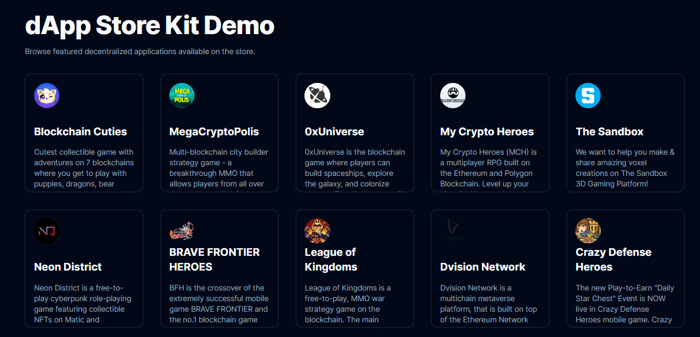

<p align="center">
  
</p>

<h1 align="center">
  dApp Store Kit Demo 
</h1>

<p align="center">
An example repo showcasing <a href="https://www.dappstorekit.io/">Polygon's dApp Store Kit</a> built with 
<a href="https://nextjs.org/">Next.js</a>, <a href="https://www.typescriptlang.org/">TypeScript</a>, and <a href="https://tailwindcss.com/">Tailwind CSS</a>.

<br/>

## Running Locally

1. Clone the repository using `git clone`.
2. Install dependencies using `npm install`.
3. Run the development server using `npm run dev`.
4. Visit `http://localhost:3000` to view the demo.

## How It Works

Below are key code snippets from the demo that show how to use the dApp Store Kit.

### Fetching Featured dApps

On the [homepage](/src//pages/index.tsx), we fetch featured gaming dApps from the registry:

```tsx
// Base URL for the mainnet API
const baseURL = "https://api-a.meroku.store";

// Instantiate the dApp Registry API
const dAppRegistryAPI = new DAppRegistryApi({
  basePath: baseURL,
});

// Get the dApps list, and store it in the state
const dAppsRequest = await dAppRegistryAPI.getDAppV1(
  1, // page
  20, // page size
  undefined, // search term
  true, // is dapp listed
  137, // Polygon chain ID
  undefined, // language
  undefined, // availableOnPlatform
  undefined, // matureForAudience
  undefined, // minAge
  undefined, // listedOnOrAfter
  undefined, // listedOnOrBefore
  undefined, // allowedInCountries
  undefined, // blockedInCountries
  [["games"]] // categories
);
const dApps = dAppsRequest.data.response;
```

### Fetching dApp By ID

On the [dApp page](/src/pages/dapps/[dappId].tsx), we fetch a dApp by its ID:

```tsx
// useEffect to fetch the dApps and store it in the state
useEffect(() => {
  (async () => {
    if (!dappId) return;

    // Base URL for the mainnet API
    const baseURL = "https://api-a.meroku.store";

    // Instantiate the dApp Registry API
    const dAppRegistryAPI = new DAppRegistryApi({
      basePath: baseURL,
    });

    // Get dApp info by ID
    const response = await dAppRegistryAPI.apiV1DappSearchDappIdGet(
      dappId as string
    );

    // Get the dApp out of the response
    const result = response?.data?.data?.[0];

    // Store the dApp in the state
    setLoadingDapp(false);
    setDapp(result);
  })();
}, [dappId]);
```

## Reach Out

Join the [Polygon Developer Discord](https://discord.gg/0xpolygondevs) for any questions or feedback!
